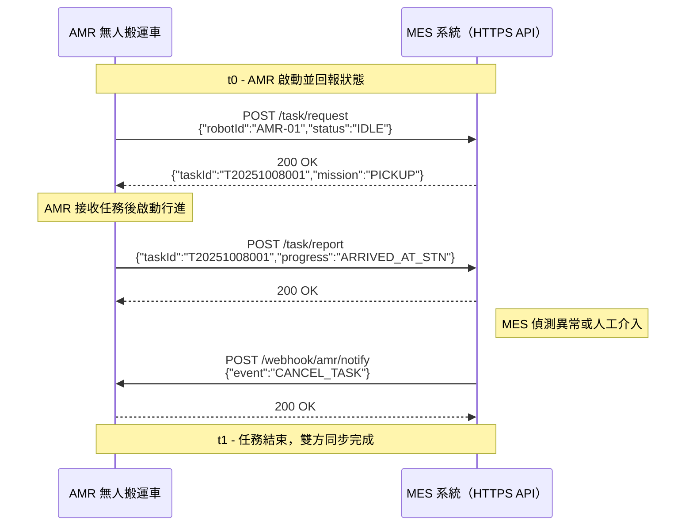
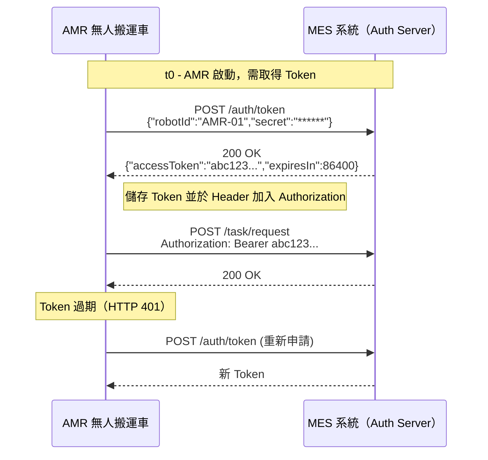

# 🧭 AMR ⇄ MES HTTPS 通訊規格書

本文件說明自走式搬運機器人（AMR）與製造執行系統（MES）之間透過 **HTTPS 通訊** 進行任務派發、回報與例外處理的協定規格，並附上實際的時序圖，供軟體與設備工程師對接開發使用。

---

## 一、通訊架構概述
- **協定**：HTTPS / RESTful API  
- **資料格式**：JSON UTF-8  
- **安全機制**：TLS 1.3 加密 + JWT 驗證  
- **連線方式**：AMR 主動呼叫 MES API，MES 回傳同步回應  
- **通訊方向**：
  - AMR → MES：請求任務、回報進度、異常上報  
  - MES → AMR：Webhook 通知、任務取消、Token 更新  

---

## 二、通訊端點與認證

### 1️⃣ API 端點範例
| 類別 | URL | 方法 |
|------|------|------|
| 任務請求 | https://mes.company.com/api/v1/task/request | POST |
| 任務回報 | https://mes.company.com/api/v1/task/report | POST |
| 任務取消 | https://mes.company.com/api/v1/task/cancel | POST |
| Token 申請 | https://mes.company.com/api/v1/auth/token | POST |

### 2️⃣ 認證方式
AMR 於每次呼叫 API 時，需於 HTTP Header 內附上 Token：  
Authorization: Bearer <AccessToken>  
Token 採用 **JWT 格式**，有效期限為 24 小時。  
若過期，AMR 需重新透過 /auth/token 申請。

---

## 三、主要 API 定義

### 🔹 1. AMR → MES：任務請求
**Method:** POST /api/v1/task/request  

**Request 範例：**  
```json
{"robotId": "AMR-01","status": "IDLE","timestamp": "2025-10-08T09:15:23Z"}
```

**Response 範例：**  
```json
{"result": "OK","taskId": "T20251008001","mission": "PICKUP","location": "STN-A"}
```

---

### 🔹 2. AMR → MES：任務進度回報
**Method:** POST /api/v1/task/report  

**Request 範例：**  
```json
{"robotId": "AMR-01","taskId": "T20251008001","progress": "ARRIVED_AT_STN","timestamp": "2025-10-08T09:25:42Z"}
```

**Response 範例：**  
```json
{"result": "ACK","message": "Report received"}
```

---

### 🔹 3. MES → AMR：Webhook 通知（任務取消）
**Method:** POST /webhook/amr/notify  

**Request 範例：**  
```json
{"robotId": "AMR-01","event": "CANCEL_TASK","reason": "Operator override"}
```

**Response 範例：**  
```json
{"result": "OK"}
```

---

## 四、任務執行時序圖


---

## 五、Token 驗證與更新流程


---

## 六、錯誤與異常處理
| 狀況 | HTTP Code | 範例回應 | 處理建議 |
|------|------------|-----------|-----------|
| Token 過期 | 401 | {"error": "Token expired"} | 重新申請 Token |
| 無效任務 ID | 404 | {"error": "Task not found"} | 忽略該任務並回報異常 |
| 系統忙碌 | 503 | {"error": "Server busy"} | 3 秒後重試一次 |
| 內部錯誤 | 500 | {"error": "Internal error"} | 上報監控系統 |

---

## 七、重試與 Timeout 機制
- 若 AMR 呼叫 MES 超過 5 秒未回應，應自動重試一次。  
- 重試上限 3 次，若仍失敗，需上報「MES_OFFLINE」事件至監控系統。  
- 任務回報與 webhook 回覆皆需於 2 秒內完成。  

---

## 八、版本與維護資訊
| 項目 | 內容 |
|------|------|
| 文件版本 | v1.0 |
| 更新日期 | 2025-10-08 |
| 撰寫單位 | 系統架構組 |
| 負責人 | Emwell |
| 備註 | 初版定義 AMR ⇄ MES HTTPS 通訊與 Token 機制 |
